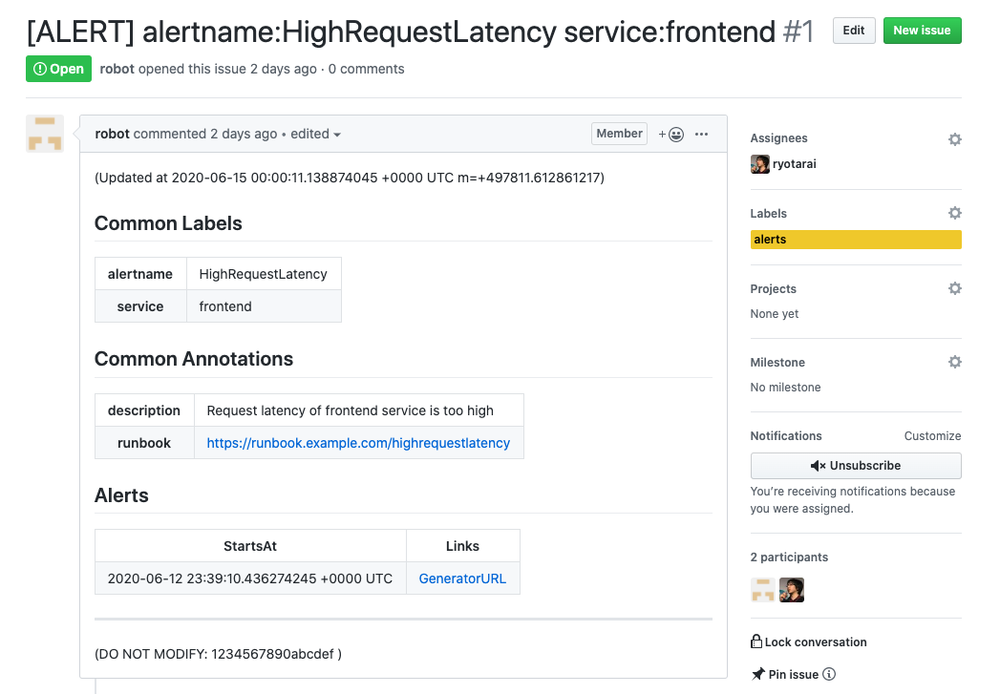

# alertmanager-to-github

This receives webhook requests from Alertmanager and creates GitHub issues.

It does:

- open an issue on a new alert
- close the issue when the alert is in resolved status
- reopen the issue when the alert is in firing status
  - alerts are identified by `groupKey`; configurable via `--alert-id-template` option

<kbd></kbd>

## Installation

### Docker image

```shell
docker pull ghcr.io/pfnet-research/alertmanager-to-github:v0.1.0
```

### go get

```shell
go get github.com/pfnet-research/alertmanager-to-github
```

## Usage

Start webhook server: 1.a or 1.b

### 1.a Personal Access Token

```shell
$ read ATG_GITHUB_TOKEN
(Personal Access Token)
$ export ATG_GITHUB_TOKEN

$ alertmanager-to-github start
```

### 1.b GitHub App

```shell
$ alertmanager-to-github start \
  --github-app-private-key-file /path/to/private-key.pem \
  --github-app-app-id 12345 \
  --github-app-installation-id 98765
```

### 2. Configure Alertmanager

Add a receiver to Alertmanager config:

```yaml
route:
  receiver: "togithub" # default

receivers:
  - name: "togithub"
    webhook_configs:
      # Create issues in "bar" repo in "foo" organization.
      # these are the default values and can be overriden by labels on the alert
      # repo and owner parameters must be URL-encoded.
      - url: "http://localhost:8080/v1/webhook?owner=foo&repo=bar"
```

## Configuration

```shell
$ alertmanager-to-github start -h
NAME:
   alertmanager-to-github start - Start webhook HTTP server

USAGE:
   alertmanager-to-github start [command options] [arguments...]

OPTIONS:
   --listen value                               HTTP listen on (default: ":8080") [$ATG_LISTEN]
   --github-url value                           GitHub Enterprise URL (e.g. https://github.example.com) [$ATG_GITHUB_URL]
   --labels value [ --labels value ]            Issue labels [$ATG_LABELS]
   --keep-labels value [ --keep-labels value ]  Keep labels from GroupLabels and CommonLabels [$ATG_KEEP_LABELS]
   --body-template-file value                   Body template file [$ATG_BODY_TEMPLATE_FILE]
   --title-template-file value                  Title template file [$ATG_TITLE_TEMPLATE_FILE]
   --alert-id-template value                    Alert ID template (default: "{{.Payload.GroupKey}}") [$ATG_ALERT_ID_TEMPLATE]
   --github-token value                         GitHub API token (command line argument is not recommended) [$ATG_GITHUB_TOKEN]
   --auto-close-resolved-issues                 Should issues be automatically closed when resolved (default: true) [$ATG_AUTO_CLOSE_RESOLVED_ISSUES]
   --github-app-private-key-file value          GitHub App's private key file [$ATG_GITHUB_APP_PRIVATE_KEY_FILE]
   --github-app-app-id value                    GitHub App's app id (required if github-app-private-key-file) (default: 0) [$ATG_GITHUB_APP_APP_ID]
   --github-app-installation-id value           GitHub App's installation id (required if github-app-private-key-file) (default: 0) [$ATG_GITHUB_APP_INSTALLATION_ID]
   --help, -h                                   show help (default: false)
```

### GitHub Enterprise

To create issues in GHE, set `--github-url` option or `ATG_GITHUB_URL` environment variable.

### Customize issue title and body

Issue title and body are rendered from [Go template](https://golang.org/pkg/text/template/) and you can use custom templates via `--body-template-file` and `--title-template-file` options. In the templates, you can use the following variables and functions.

- Variables
  - `.Payload`: Webhook payload incoming to this receiver. For more information, see `WebhookPayload` in [pkg/types/payload.go](https://github.com/pfnet-research/alertmanager-to-github/blob/master/pkg/types/payload.go)
- Functions
  - `urlQueryEscape`: Escape a string as a URL query
  - `json`: Marshal an object to JSON string
  - `timeNow`: Get current time

## Customize organization and repository

The organization/repository where issues are raised can be customized per-alert by specifying the `atg_owner` label for the organization and/or the `atg_repo` label for the repository on the alert.

e.g.

```yaml
- alert: HighRequestLatency
  expr: job:request_latency_seconds:mean5m{job="myjob"} > 0.5
  for: 10m
  labels:
    severity: page
    atg_owner: my-alternative-org
    atg_repo: specific-service-repository
  annotations:
    summary: High request latency
```

This mechanism has precedence over the receiver URL query parameters.

## Deployment

### Kubernetes

https://github.com/pfnet-research/alertmanager-to-github/tree/master/example/kubernetes

## Releaese

The release process is fully automated by [tagpr](https://github.com/Songmu/tagpr). To release, just merge [the latest release PR](https://github.com/pfnet-research/alertmanager-to-github/pulls?q=is:pr+is:open+label:tagpr).
